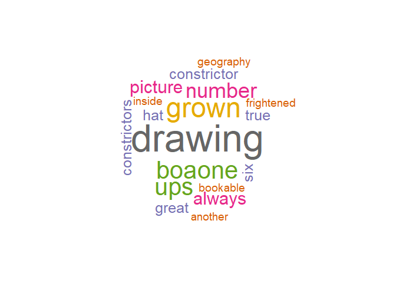

My Text Mining Repository
================
Amin Rigi

"Last Update: 2018-05-14

After few months of text mining for few industry projects, I decided to neatly pack the functions that I use the most into a single place. This repository is such a place. I eventually will update this repository. I start with simple text cleaning and tidy text mining and then will add ML-based tools.

Text pre-processing
-------------------

Text pre-processing consists of several steps such as removal of stopwords, numerical characters, and punctuations. Few other steps are fixing encoding, consistency between US and UK English, and dealing with exceptional situations. The function [`tm/pre-process`](https://github.com/aminrigi/Text-Mining/blob/master/tm/pre_process.R) will do this. Let's clean the first chapter of [The Little Prince](http://users.uoa.gr/~nektar/arts/tributes/antoine_de_saint-exupery_le_petit_prince/the_little_prince.htm) using [`pre-process.R`](https://github.com/aminrigi/Text-Mining/blob/master/tm/pre_process.R).

``` r
source("tm/pre_process.R")

myText = "Once when I was six years old I saw a magnificent picture in a book, called True Stories from Nature, about the primeval forest. It was a picture of a boa constrictor in the act of swallowing an animal. Here is a copy of the drawing.
Boa

In the book it said: Boa constrictors swallow their prey whole, without chewing it. After that they are not able to move, and they sleep through the six months that they need for digestion.

I pondered deeply, then, over the adventures of the jungle. And after some work with a colored pencil I succeeded in making my first drawing. My Drawing Number One. It looked something like this:
Hat

I showed my masterpiece to the grown-ups, and asked them whether the drawing frightened them.

But they answered: Frighten? Why should any one be frightened by a hat?

My drawing was not a picture of a hat. It was a picture of a boa constrictor digesting an elephant. But since the grown-ups were not able to understand it, I made another drawing: I drew the inside of a boa constrictor, so that the grown-ups could see it clearly. They always need to have things explained. My Drawing Number Two looked like this:
Elephant inside the boa

The grown-ups' response, this time, was to advise me to lay aside my drawings of boa constrictors, whether from the inside or the outside, and devote myself instead to geography, history, arithmetic, and grammar. That is why, at the age of six, I gave up what might have been a magnificent career as a painter. I had been disheartened by the failure of my Drawing Number One and my Drawing Number Two. Grown-ups never understand anything by themselves, and it is tiresome for children to be always and forever explaining things to them.

So then I chose another profession, and learned to pilot airplanes. I have flown a little over all parts of the world; and it is true that geography has been very useful to me. At a glance I can distinguish China from Arizona. If one gets lost in the night, such knowledge is valuable.

In the course of this life I have had a great many encounters with a great many people who have been concerned with matters of consequence. I have lived a great deal among grown-ups. I have seen them intimately, close at hand. And that hasn't much improved my opinion of them.

Whenever I met one of them who seemed to me at all clear-sighted, I tried the experiment of showing him my Drawing Number One, which I have always kept. I would try to find out, so, if this was a person of true understanding. But, whoever it was, he, or she, would always say:

That is a hat.

Then I would never talk to that person about boa constrictors, or primeval forests, or stars. I would bring myself down to his level. I would talk to him about bridge, and golf, and politics, and neckties. And the grown-up would be greatly pleased to have met such a sensible man."

myStopwords = c("have", "whoever")

cleaned_text = pre_process(txt = myText, myStopwords = myStopwords)

print(cleaned_text)
```

    ## [1] " six years old saw magnificent picture book called true stories nature primeval forest picture boa constrictor act swallowing animal copy drawing boa book said boa constrictors swallow prey whole without chewing able move sleep six months need digestion pondered deeply adventures jungle work colored pencil succeeded making first drawing drawing number one looked something like hat showed masterpiece grown ups asked whether drawing frightened answered frighten one frightened hat drawing picture hat picture boa constrictor digesting elephant since grown ups able understand made another drawing drew inside boa constrictor grown ups see clearly always need things explained drawing number two looked like elephant inside boa grown ups response time advise lay aside drawings boa constrictors whether inside outside devote instead geography history arithmetic grammar age six gave might magnificent career painter disheartened failure drawing number one drawing number two grown ups never understand anything tiresome children always forever explaining things chose another profession learned pilot airplanes flown little parts world true geography useful glance can distinguish china arizona one gets lost night knowledge valuable course life great many encounters great many people concerned matters consequence lived great deal among grown ups seen intimately close hand hasn  much improved opinion whenever met one seemed clear sighted tried experiment showing drawing number one always kept try find person true understanding  always say hat never talk person boa constrictors primeval forests stars bring level talk bridge golf politics neckties grown greatly pleased met sensible man "

Wordcloud of a Text
-------------------

Functions [`tm/plot_wordCloud.R`](https://github.com/aminrigi/Text-Mining/blob/master/tm/plot_feelingCloud.R) and [`tm/plot_wordCloud2.R`](https://github.com/aminrigi/Text-Mining/blob/master/tm/plot_feelingCloud2.R) can be used for plotting wordcloud or wordcloud2 for a chunk of text. Here's the wordcloud for first chapter of *The Little Prince*:

``` r
source("tm/plot_wordCloud2.R")
plot_wordCloud2(cleaned_text, 20)
```


``` r
source("tm/plot_wordCloud.R")
plot_wordCloud(cleaned_text, 20)
```



[Feeling Cloud](https://github.com/aminrigi/Feeling-Cloud) of a Text
--------------------------------------------------------------------

Functions [`tm/plot_feelingCloud.R`](https://github.com/aminrigi/Text-Mining/blob/master/tm/plot_feelingCloud.R) and [`tm/plot_feelingCloud2.R`](https://github.com/aminrigi/Text-Mining/blob/master/tm/plot_feelingCloud2.R) are for plotting feeling cloud of a text. For more on feeling cloud take a look at [here](https://github.com/aminrigi/Feeling-Cloud).

``` r
source("tm/plot_feelingCloud.R")
plot_feelingCloud(cleaned_text, 20)
```

 Comparing feeling cloud of the text with its word cloud may give you some idea about feeling cloud.

To Be Continued...
